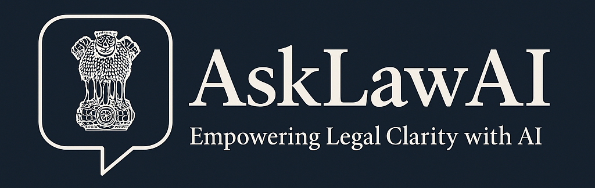

# 🧠 AskLawAI – Legal Advice Chatbot Using LLMs

AskLawAI is an AI-powered Legal Assistant built using **Streamlit** and integrated with multiple Large Language Models (LLMs) like **Ollama**, **OpenAI**, and **Gemini**. It allows users to upload legal documents (PDFs), ask context-aware questions, and receive structured legal-style answers. You can also ask general legal queries in a separate tab.

> ⚠️ This chatbot is for **educational and informational purposes only** and does **not provide real legal advice**.

---

## ✨ Features

- 📄 **PDF Upload**: Upload legal contracts, agreements, or policy documents.
- 🤖 **Ask Questions**: Ask document-specific or general legal questions.
- 🔎 **Semantic Search**: Uses embeddings to understand and retrieve relevant legal content.
- 🧠 **LLM Support**: Choose between local (Ollama) or cloud (OpenAI, Gemini) models.
- 🔐 **Secure API Management**: API keys stored safely in session state.
- 🎯 **Prompt Engineering**: Custom prompts ensure formal, structured legal answers.
- 🌐 **Web Interface**: Simple and interactive UI built using Streamlit.

---

## 🛠️ Installation

### 1. Clone the Repository

```bash
git clone https://github.com/yourusername/asklawai.git
cd asklawai
```

### 2. Create a Virtual Environment

```bash
python -m venv venv
source venv/bin/activate   # On Windows: venv\Scripts\activate
```

### 3. Install Dependencies

```bash
pip install -r requirements.txt
```

### 4. Install Ollama (if using local models)

Download and install Ollama from: https://ollama.com

Then pull a model like:

```bash
ollama run llama3
```

---

## 🚀 Run the App

```bash
streamlit run app.py
```

Once running, open your browser at `http://localhost:8501`.

---

## 🔐 API Keys Setup

- OpenAI (e.g. `gpt-3.5-turbo`, `gpt-4`)
- Gemini (e.g. `gemini-pro`)

You can enter these keys directly in the **Streamlit sidebar**. They are stored securely in the current session.

---

## 🧠 Supported Models

| Provider | Model Examples       | Notes                        |
|----------|----------------------|------------------------------|
| Ollama   | `llama3`, `mistral`  | No API key required          |
| OpenAI   | `gpt-3.5-turbo`      | Requires OpenAI API Key      |
| Gemini   | `gemini-pro`         | Requires Gemini API Key      |

---

## 🧩 Technologies Used

- `Streamlit` – Web app framework
- `LangChain` – LLM chaining and retrieval
- `FAISS` – Vector store for document embeddings
- `PyPDF2` – PDF parsing
- `OpenAI`, `Gemini`, `Ollama` – Language Models

---

## 📂 Project Structure

```
asklawai/
│
├── app.py              # Main Streamlit app
├── requirements.txt    # Python dependencies
├── README.md           # Project documentation
```

You can modularize further (e.g., `utils/`, `components/`, `config.py`).

---

## ✅ Example Use Cases

- Understand sections of a lease agreement
- Ask HR policy-related questions
- Decode legal jargon in contracts
- Ask general law-related questions like “What is an NDA?”

---

## 🧠 Prompt Template Used

```
You are a legal advisor chatbot. When asked a question based on a legal document, answer formally in a legal tone.

If the question is not related to the document context, still provide a helpful and professional response.

Mention the clause or section if possible.
```

---

## 📢 Disclaimer

> **AskLawAI is not a substitute for professional legal advice.** Always consult a qualified lawyer for legal matters.

---

## 🙌 Acknowledgements

- OpenAI, Gemini, and Ollama for powerful LLM APIs
- LangChain for simplifying LLM integration
- Streamlit for rapid UI prototyping

---

## 🪪 License

This project is licensed under the **MIT License**. Feel free to use and modify it.

---

## 🤝 Contributions

PRs and feedback are welcome! If you find issues or want to add features, feel free to contribute.

---

## 📬 Contact

For queries or collaborations: [akshayshekade757@gmail.com]

---

## ⭐ Star this repo if you find it useful!

---
